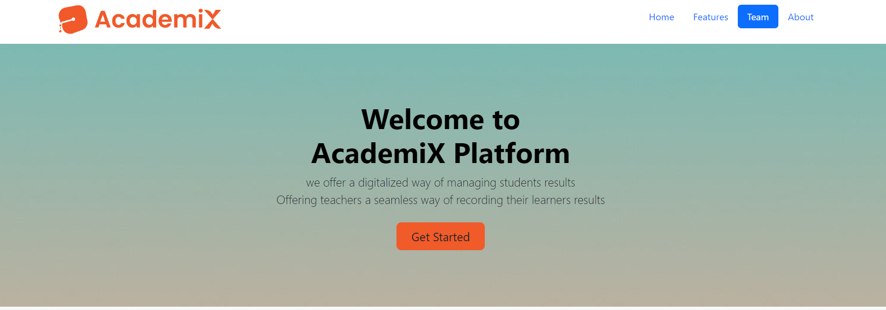

# AcademiX-Platform

# Introduction

 AcademiX is an online platform that enables educational institutions to easily manage their routine activities such as:
 - creation of Teacher accounts
 - creation of student accounts
 - Management of courses
 - Teachers recording of Marks
 - Student consultation of their results

## Motivation of AcademiX

Apart from being software engineer and UI/UX designers, we are also professional teachers. we happen to come from the North west region of Cameroon which has been affected by serious conflict for over 7 years now.
Tekoh Palma Happen to be an instructor of computer science at 
Government Teachers Training College (GTTC) Ndop which is highly affected by this crisis. which  makes it so difficult for teachers to give and record marks of their learners  leading to learners going without report cards and hence not having the ability to evaluate their level of preparedness towards their CAPIEMP Exams. 
This motivated us to come up with a solution which can help ameliorate this problem called AcademiX.

# Link to official wesite
	- https://matrix30.github.io/AcademiX-Platform/
	- Academix.cyanide.tech

Must include link to your deployed site, final project blog article, author(s) LinkedIn

# project Blog Article
	- 

# Installation

# Usage

# Authors
	- Tekoh Palma Achu 
		Email: tekohpalma@gmail.com
		LinkedIn: https://www.linkedin.com/in/tekoh-palma/
		GitHub: Matrix30

	- Tekoh Bildad Fon 
		Email: billybill953@gmail.com
		LinkedIn:
		GitHub: Emperorl-Bill

# Related projects

# Licensing